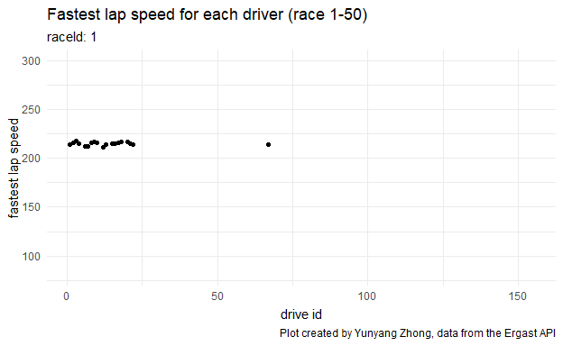

```{r setup, include=FALSE}
knitr::opts_chunk$set()
```

```{r, echo=FALSE}
library(tidyverse)     # for graphing and data cleaning
library(lubridate)     # for date manipulation
library(ggthemes)      # for even more plotting themes
library(plotly)        # for the ggplotly() - basic interactivity

library(gganimate)     # for adding animation layers to ggplots
library(transformr)    # for "tweening" (gganimate)
library(gifski)        # need the library for creating gifs but don't need to load each time
theme_set(theme_minimal())
```

```{r, echo=FALSE, message=FALSE}
#tuesdata <- tidytuesdayR::tt_load('2021-09-07')
#results <- tuesdata$results
results <- readr::read_csv('https://raw.githubusercontent.com/rfordatascience/tidytuesday/master/data/2021/2021-09-07/results.csv')
```

```{r, message=FALSE}
tidy <- results %>% 
  filter(fastestLapSpeed!='\\N') %>% 
  filter(raceId<=50) %>% 
  mutate(fastestLapSpeed = as.numeric(fastestLapSpeed)) %>% 
  ggplot() +
  geom_point(aes(x = driverId, y = fastestLapSpeed)) +
  scale_y_continuous(name = "fastest lap speed", limits = c(80,300)) +
  transition_states(raceId) +
  labs(title = "Fastest lap speed for each driver (race 1-50)",
       subtitle = "raceId: {closest_state}",
       x = "drive id",
       caption = "Plot created by Yunyang Zhong, data from the Ergast API")

anim_save("tidy.gif", tidy)
```

```{r}

```

> I created this graph to help answer whether the fastest lap speeds are similar for different races and how frequently the drivers join a race. Because there are over 1000 races and over 800 drivers and I was trying to make a gif, I only focused on races 1-50 to not overwhelm the audience with too much information. fastestLapSpeed is the most important variable for my focus and thus my first step was to remove all missing values. I also changed it to numeric so that it was possible to create a continuous y-axis. y-axis labels were restructured as well to better present the points mostly in the middle of the graph. A scatterplot was chosen since I wanted to underscore the overall trend and clutter of points could help achieve so. From the gif, it seems that the fastest lap speeds fluctuate in different races and that drivers with id 1-50 are the most frequent players.