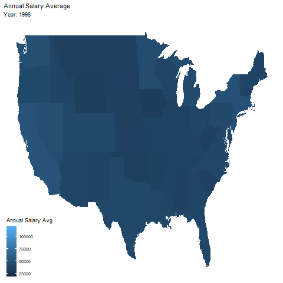

```{r setup, include=FALSE}
knitr::opts_chunk$set(echo = FALSE)
```

```{r}
library(tidyverse)     # for data cleaning and plotting
library(maps)          # for map data
library(ggmap)         # for mapping points on maps
library(gplots)        # for col2hex() function
library(RColorBrewer)  # for color palettes
library(sf)            # for working with spatial data
library(leaflet)       # for highly customizable mapping
library(ggthemes)      # for more themes (including theme_map())
library(plotly)        # for the ggplotly() - basic interactivity
library(gganimate)     # for adding animation layers to ggplots
library(transformr)    # for "tweening" (gganimate)
library(gifski)        # need the library for creating gifs but don't need to load each time

nurses <- readr::read_csv('https://raw.githubusercontent.com/rfordatascience/tidytuesday/master/data/2021/2021-10-05/nurses.csv')
```

```{r}
states_map <- map_data("state")
```

```{r, fig.width=20, eval=FALSE}
tidy <- nurses %>% 
  mutate(state = str_to_lower(State)) %>% 
  ggplot() +
  geom_map(map = states_map,
           aes(map_id = str_to_lower(State),
               fill = `Annual Salary Avg`,
               group = Year)) +
  expand_limits(x = states_map$long, y = states_map$lat) + 
  theme_map() +
  theme(legend.background = element_blank()) +
  transition_states(Year, transition_length = 0) +
  labs(title = "Annual Salary Average",
       subtitle = "Year: {closest_state}")

animate(tidy, nframes = 200, end_pause = 10)

anim_save("tidy.gif", tidy)
```

```{r}

```

> I created this graph to help answer which states give the highest average annual salary 1998-2020 and how nurses' salary changes over the years. I plotted the annual average onto a map and made it a gif, showing values from 1998-2020. I also changed end_pause to 10 to make it easier to follow. States on the west coast seem to have the highest average annual salary while states in the middle have lower. The average increases over the years in all states.
